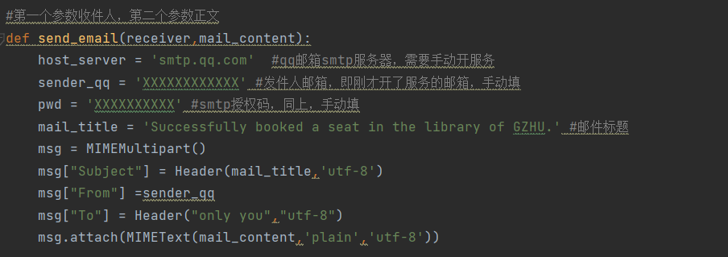

# GZHU-library_booking
广州大学图书馆定时预约座位附邮件发送

### Tips

可以通过源码来修改座位信息的网址，目前只加了几个房间如下


邮箱配置



### 运行步骤

首先填好config0.json文件，包括自己的数字广大账号与密码，还有座位信息，预约时间等等

可以写一个run.sh脚本运行，推荐挂ubuntu服务器弄定时任务，样例如下

```sh
#!/bin/bash
  
# 设置 conda 环境变量(如果有conda，可选)
export PATH="/root/miniconda3/bin:$PATH"
# 激活 conda 环境(同上，如果有conda，可选)
source activate test


# 获取当前脚本的运行路径
SCRIPT_DIR="$(cd "$(dirname "${BASH_SOURCE[0]}")" && pwd)"

# 进入当前脚本的运行路径
cd "$SCRIPT_DIR"

# 运行 main.py
python main.py
```

如果python文件缺少什么库，就需要自己pip安装对应的库即可。