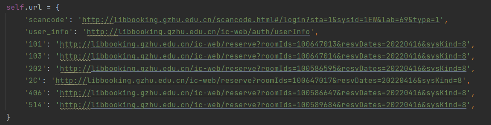

# 广州大学GZHU-library_booking

## 免责声明

本项目仅做免费的学术交流使用。仅适用于天天去图书馆的同学。

## 简介

1. 广州大学图书馆定时预约座位附邮件发送。
2. 自定义预约时间，自定义预约位置
3. 可以通过设置定时任务，来控制该程序启动的时间。

## Tips

- ### **可以通过修改源码来更换书库号的网址，目前只加了如下几个书库号**




- ### **邮箱配置**


## 运行步骤

1. 首先填好config0.json文件，包括自己的数字广大账号与密码，还有座位信息，预约时间等等
2. 然后使用python运行main.py文件即可。

## 脚本运行，**Linux ubuntu**服务器下用cron弄定时启动任务（推荐）

​	1. 写一个run.sh脚本，run.sh的内容示例如下

```sh
#!/bin/bash
# 设置 conda 环境变量(如果有conda，可选)
export PATH="/root/miniconda3/bin:$PATH"
# 激活 conda 环境(同上，如果有conda，可选)
source activate test

# 获取当前脚本的运行路径
SCRIPT_DIR="$(cd "$(dirname "${BASH_SOURCE[0]}")" && pwd)"
# 进入当前脚本的运行路径
cd "$SCRIPT_DIR"
# 运行 main.py
python main.py
```

​	2. 初始化crontab

```bash
crontab -e
```

​	3. 写入任务，比如在每天的6.30跑run.sh程序并且将日志信息写入logfile.log

```bash
30 6 * * * /path/run.sh >> /path/logfile.log 2>&1
```

​	4. 重启服务

```bash
sudo service cron restart
```

至此，全部配置完毕，就能自动定时预约了

## FAQ

### **Q：如果运行失败怎么办？**

- 请先检查学号密码座位是否输入错误
- 如果python文件缺少什么库，就需要自己pip安装对应的库即可。
- 其它时候大多是因为校园网网络服务问题，可以尝试重新运行脚本

## Last

如果觉得好用，**不要忘记点个Star哦~**

